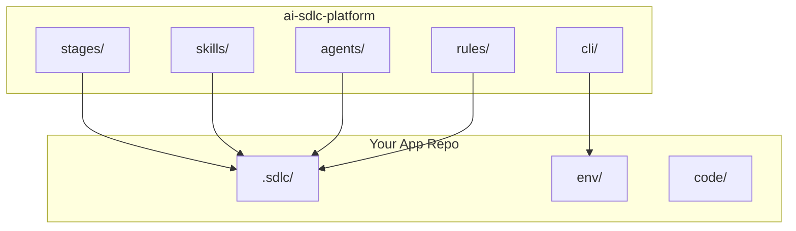

# Repository Layout

## 💡 What this is

How repos, IDE, and CLI connect.

---

## 🗂️ Two Repositories



---

## Platform Repo (ai-sdlc-platform)

Shared across all projects:

| Directory | Contains |
|-----------|----------|
| `stages/` | 15 SDLC stages |
| `skills/` | Reusable capabilities |
| `agents/` | AI personas |
| `rules/` | Governance |
| `cli/` | Commands |
| `templates/` | Story/PRD templates |

**Location**: Clone once, share via symlinks.

---

## App Repo (Your Project)

Per-project state:

| Directory | Contains |
|-----------|----------|
| `.sdlc/` | State, memory, module KB |
| `env/` | Credentials (not committed) |
| `.claude/` | IDE commands (symlink) |
| `.cursor/` | IDE rules (symlink) |
| `stories/` | Story files |

**Location**: One per git repo.

---

## 🔧 How Symlinks Work

Setup creates links:
```
Your-App/.claude/commands/ → ai-sdlc-platform/.claude/commands/
Your-App/.cursor/rules/    → ai-sdlc-platform/rules/
```

**Benefit**: Platform updates flow automatically.

---

## 🔧 What you can do

### Check layout
```bash
ls -la .sdlc/
ls -la .claude/
sdlc doctor
```

### Repair symlinks
```bash
bash scripts/repair-claude-mirrors.sh
./setup.sh /path/to/project
```

### Multi-repo setup
```bash
./scripts/setup-repos-from-manifest.sh repos.manifest
```

---

## 👉 What to do next

**Install** → [Getting_Started](Getting_Started.md)

**Add repos** → [Team_Onboarding](Team_Onboarding.md)

**Architecture** → [Architecture](Architecture.md)

---

*For more details, ask: "How do repos connect?" or "What is the canonical layout?"*
