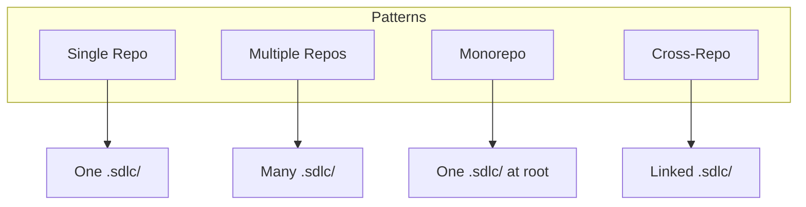
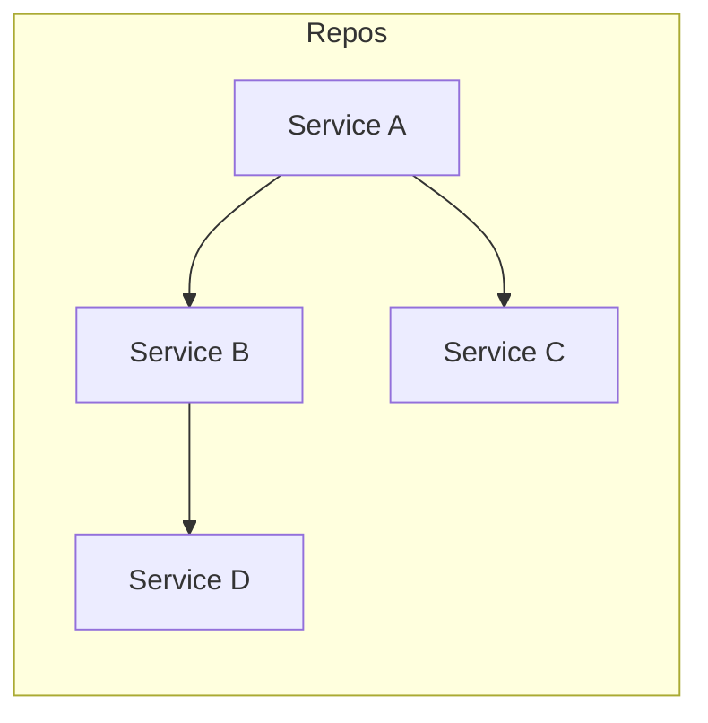
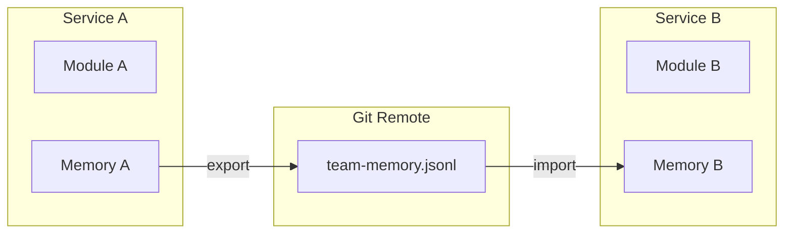

# Repository Setup Scenarios

## 💡 What this is

How to set up AI-SDLC for different repository structures.

---

## 🎯 4 Setup Patterns



---

## 1️⃣ Single Repo Setup

**When to use**: One application, one git repository.

### Setup
```bash
# Clone platform once
git clone <ai-sdlc-platform>
cd ai-sdlc-platform

# Setup your single app
./setup.sh /path/to/your/app
```

### What you get
```
Your-App/
├── .sdlc/              # State & memory
├── .claude/            # IDE commands (symlink)
├── .cursor/            # IDE rules (symlink)
├── env/                # Credentials
└── src/                # Your code
```

**Result**: One SDLC context for one app.

---

## 2️⃣ Multiple Repos Setup (Microservices)

**When to use**: Many microservices, each with own repo.

### Manual setup (for each repo)
```bash
# Service 1
cd /path/to/service1
/path/to/ai-sdlc-platform/setup.sh .

# Service 2
cd /path/to/service2
/path/to/ai-sdlc-platform/setup.sh .
```

### Bulk setup (automated)
```bash
# Create repos.manifest file
cat > repos.manifest << EOF
/path/to/service1
/path/to/service2
/path/to/service3
EOF

# Run bulk setup
cd /path/to/ai-sdlc-platform
./scripts/setup-repos-from-manifest.sh repos.manifest
```

### What you get
```
service1/               service2/               service3/
├── .sdlc/              ├── .sdlc/              ├── .sdlc/
│   ├── module/         │   ├── module/         │   ├── module/
│   │   └── APIs        │   │   └── APIs        │   │   └── APIs
│   └── memory/         │   └── memory/         │   └── memory/
│       └── decisions   │       └── decisions   │       └── decisions
├── .claude/            ├── .claude/            ├── .claude/
└── src/                └── src/                └── src/
```

**Result**: Independent SDLC contexts per service.

### How it works in multi-repo

Each repo has its own isolated context:

| Feature | Per Repo | Shared? |
|---------|----------|---------|
| **Module KB** | `.sdlc/module/` | ❌ No (each repo scans own code) |
| **Semantic Memory** | `.sdlc/memory/` | ⚠️ Via git sync only |
| **State** | `.sdlc/state.json` | ❌ No (per repo) |
| **Platform** | Symlinks to `ai-sdlc-platform/` | ✅ Yes (same rules) |

**Running commands**: You run `sdlc` from within each repo:
```bash
cd /path/to/service1
sdlc module init .        # Scans service1 code only
sdlc memory init          # Service1 memory only

cd /path/to/service2  
sdlc module init .        # Scans service2 code only
sdlc memory init          # Service2 memory only
```

**Platform updates**: All repos share the same platform rules/skills via symlinks. When you `git pull` in `ai-sdlc-platform/`, all repos get the updates immediately.

---

## 3️⃣ Monorepo Setup

**When to use**: Multiple apps in one git repository.

### Setup
```bash
# At monorepo root
cd /path/to/monorepo
/path/to/ai-sdlc-platform/setup.sh .
```

### Structure
```
monorepo/
├── .sdlc/                  # One SDLC at root
├── .claude/
├── .cursor/
├── apps/
│   ├── frontend/
│   ├── backend/
│   └── mobile/
├── packages/
│   ├── shared-lib/
│   └── ui-components/
└── services/
    ├── api-gateway/
    └── worker-service/
```

### Benefits
- **One `.sdlc/`**: Shared memory across all apps
- **Cross-app context**: AI sees entire codebase
- **Unified stories**: Track work across apps

### Commands
```bash
# Load all modules
sdlc module load api,data,logic

# Context spans all apps
sdlc memory semantic-query --text="auth across apps"
```

**Result**: Single SDLC context for entire monorepo.

---

## 4️⃣ Cross-Repo Setup (Dependencies)

**When to use**: Services depend on each other across repos.

### Setup dependencies
```bash
# Declare dependency: serviceA depends on serviceB
sdlc repos depend serviceA serviceB

# Check impact
sdlc repos check serviceA

# Show dependency graph
sdlc repos deps
```

### What you get


### Cross-repo memory
```bash
# Export from serviceB
sdlc memory semantic-export

# Import in serviceA (via git pull)
sdlc memory semantic-import

# Query across repos
sdlc memory semantic-query --text="breaking changes in API"
```

**Result**: Linked SDLC contexts with dependency tracking.

### How cross-repo memory sharing works

When you have multiple repos that depend on each other:



**The flow**:
1. **Export**: `sdlc memory semantic-export` creates `.sdlc/memory/semantic-memory-team.jsonl`
2. **Commit**: `git add .sdlc/memory/` + `git commit` + `git push`
3. **Pull**: Other repos `git pull` to get the JSONL file
4. **Import**: `sdlc memory semantic-import` loads it into local SQLite

**What gets shared**:
- ✅ Design decisions
- ✅ API contracts
- ✅ QA findings
- ❌ Module KB (code facts stay per-repo)
- ❌ Credentials (in `env/`)

---

## 📊 Comparison

| Setup | Use When | SDLC Context | Best For |
|-------|----------|--------------|----------|
| **Single** | One app | One `.sdlc/` | Simple projects |
| **Multiple** | Microservices | Per service | Independent teams |
| **Monorepo** | Multi-app codebase | Shared at root | Tight coupling |
| **Cross-Repo** | Service dependencies | Linked | Distributed systems |

---

## 🔧 What you can do

### Switch between repos
```bash
# List all repos
sdlc repos list

# Switch context
sdlc repos switch service2
```

### Sync cross-repo
```bash
# Export team memory
sdlc memory semantic-export

# Commit and push (team gets it via git)
git add .sdlc/memory/semantic-memory-team.jsonl
git commit -m "sync: API decisions"
git push

# Others import after pull
sdlc memory semantic-import
```

### Check dependencies
```bash
# Show graph
sdlc repos deps

# Check impact
sdlc repos check serviceA

# Notify dependents
sdlc repos notify serviceB
```

---

## ❓ Multi-Repo FAQ

### Q: Will `sdlc module init` work on all my repos?

**Yes**, but you run it per repo:
```bash
# Each repo scans its own code
for repo in service1 service2 service3; do
  cd /path/to/$repo
  sdlc module init .
done
```

Each `.sdlc/module/` is independent and contains only that repo's code facts.

### Q: How do I share context between repos?

**Via semantic memory (git-synced)**:
```bash
# In service1
sdlc memory semantic-upsert --key="API-v2-contract" --content-file=api.md
sdlc memory semantic-export
git add .sdlc/memory/semantic-memory-team.jsonl
git commit -m "docs: API v2 contract"
git push

# In service2 (after git pull)
sdlc memory semantic-import
sdlc memory semantic-query --text="API v2 contract"
```

### Q: Can AI see code from other repos?

**Not automatically**. Each repo's `.sdlc/module/` is isolated. To share:

1. **Monorepo**: Put all code in one repo → AI sees everything
2. **Cross-repo**: Manually export/import module summaries via memory
3. **Dependencies**: Use `sdlc repos depend` to track relationships

### Q: Do I need to run setup for each repo?

**Yes**. Each repo needs its own `.sdlc/` directory:
```bash
# One-time per repo
/path/to/ai-sdlc-platform/setup.sh /path/to/repo1
/path/to/ai-sdlc-platform/setup.sh /path/to/repo2
```

### Q: How do platform updates work with multiple repos?

**All repos share the platform via symlinks**:
```
repo1/.claude/commands/ → ai-sdlc-platform/.claude/commands/
repo2/.claude/commands/ → ai-sdlc-platform/.claude/commands/
```

When you update the platform:
```bash
cd /path/to/ai-sdlc-platform
git pull  # All repos immediately get new rules/skills
```

### Q: What about CI/CD with multiple repos?

Each repo runs `sdlc doctor` independently:
```yaml
# service1/.github/workflows/sdlc.yml
- name: Validate SDLC
  run: |
    /path/to/ai-sdlc-platform/cli/sdlc.sh doctor
    /path/to/ai-sdlc-platform/cli/sdlc.sh module validate
```

---

## 👉 What to do next

**Single repo** → [Getting_Started](Getting_Started.md)

**Multiple repos** → [Team_Onboarding](Team_Onboarding.md)

**Monorepo** → [Repo_Layout](Repo_Layout.md)

**Architecture** → [Architecture](Architecture.md)

---

*For more details, ask: "Which setup should I use?" or "How do I set up [scenario]?"*
