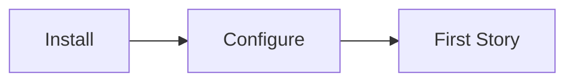

# Team Onboarding

## 💡 What this is

Get your team productive with AI-SDLC in 30 minutes.

---

## 🚀 3-Step Onboarding



---

## Step 1: Install (5 min)

### Platform lead runs:
```bash
git clone <ai-sdlc-platform-repo>
cd ai-sdlc-platform
./setup.sh /path/to/your/project
```

### Each developer runs:
```bash
cd your-project
sdlc doctor              # Verify setup
sdlc use backend --stack=java  # Set your role
```

---

## Step 2: Configure (10 min)

### Add ADO credentials (optional):
```bash
# env/.env
ADO_ORG=your-org
ADO_PROJECT=your-project
ADO_PAT=your-token
```

### Verify IDE integration:
- Cursor: Check `.cursor/rules/`
- Claude Code: Check `.claude/commands/`

---

## Step 3: First Story (15 min)

### Create a test story:
```bash
sdlc story create master --output=./stories/
# Fill in the template
sdlc story validate stories/MS-Test.md
sdlc story push stories/MS-Test.md
```

### Run first stage:
```bash
sdlc run 08-implementation
```

---

## 🎭 Role Quick Start

| Role | First Command |
|------|---------------|
| **Backend** | `sdlc use backend --stack=java` |
| **Frontend** | `sdlc use frontend --stack=react-native` |
| **QA** | `sdlc use qa` |
| **Product** | `sdlc use product` |
| **UI** | `sdlc use ui --stack=figma-design` |

---

## 📚 Team Training (30 min)

### Hour 1: Concepts
- [System_Overview](System_Overview.md) — Big picture
- [SDLC_Flows](SDLC_Flows.md) — 15 stages

### Hour 2: Practice
- [Happy_Path_End_to_End](Happy_Path_End_to_End.md) — Walkthrough
- [Commands](Commands.md) — Hands-on

---

## 🔧 What you can do

### Bulk setup (many repos)
```bash
# Create repos.manifest (one path per line)
./scripts/setup-repos-from-manifest.sh repos.manifest
```

**What happens**:
- Each repo gets its own `.sdlc/` directory
- Platform symlinks shared across all repos
- Each repo runs `sdlc module init` independently
- Team memory syncs via git

**See full details**: [Repo_Setup_Scenarios](Repo_Setup_Scenarios.md)

### Check team status
```bash
sdlc doctor
sdlc context
```

### Share knowledge
```bash
sdlc memory semantic-export    # Share decisions
sdlc module update              # Update code KB
```

---

## 👉 What to do next

**Install guide** → [Getting_Started](Getting_Started.md)

**Role playbook** → [Role_and_Stage_Playbook](Role_and_Stage_Playbook.md)

**Full walkthrough** → [Happy_Path_End_to_End](Happy_Path_End_to_End.md)

---

*For more details, ask: "How do I onboard my team?" or "What training is needed?"*
