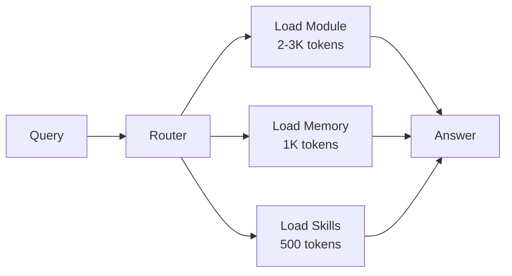

# Token Efficiency & Context Loading

## 💡 What this is

How AI-SDLC saves tokens and loads only what you need.

**Result**: 70-80% fewer tokens vs full codebase loading.

---

## 🎯 The Problem

Loading entire codebase wastes tokens:
- 10K+ lines = 3,000+ tokens
- Slow responses
- High costs
- Lost context

---

## 🔄 Our Solution: Smart Loading



---

## 🔧 How It Works

### 1. Module KB (Code Facts)
Pre-extracted from your repo:
- APIs
- Contracts
- Dependencies
- Layout

```bash
sdlc module load api      # Load only APIs
sdlc module load logic    # Load business logic
sdlc module load data     # Load data layer
```

**Tokens**: 500-2,000 (vs 10,000+ full load)

### 2. Semantic Memory (Decisions)
Long-lived context:
- Design decisions
- QA findings
- Release notes

```bash
sdlc memory semantic-query --text="auth flow" --limit=3
```

**Tokens**: 300-1,000 (targeted)

### 3. Tiered Skills
Only load skills you need:
- **Atomic**: 50 lines each
- **Composed**: Reuse atomics
- **No duplication**

---

## 📊 Savings Breakdown

| Approach | Tokens | Use Case |
|----------|--------|----------|
| Full codebase | 12,000+ | ❌ Avoid |
| Module KB | 2,000 | ✅ Design |
| Memory query | 800 | ✅ Decisions |
| Skill only | 500 | ✅ Quick task |

---

## 🎯 Budgets by Role

| Role | Budget | Why |
|------|--------|-----|
| Backend | 4,000 | Deep code analysis |
| Frontend | 3,500 | UI patterns |
| QA | 3,000 | Test scenarios |
| Product | 2,500 | Requirements |

Enforced at runtime.

---

## 🔧 What you can do

### Check budget
```bash
sdlc tokens status
sdlc cost estimate
```

### Load smart context
```bash
sdlc module load api,data
sdlc memory semantic-query --text="query"
```

### Optimize further
```bash
sdlc module validate      # Check for bloat
sdlc memory semantic-lifecycle  # Clean old entries
```

---

## 👉 What to do next

**See module system** → `sdlc module init .`

**See memory system** → [Persistent_Memory](Persistent_Memory.md)

**Architecture deep dive** → [Architecture](Architecture.md)

---

*For more details, ask: "How do I optimize token usage?" or "What is smart loading?"*
