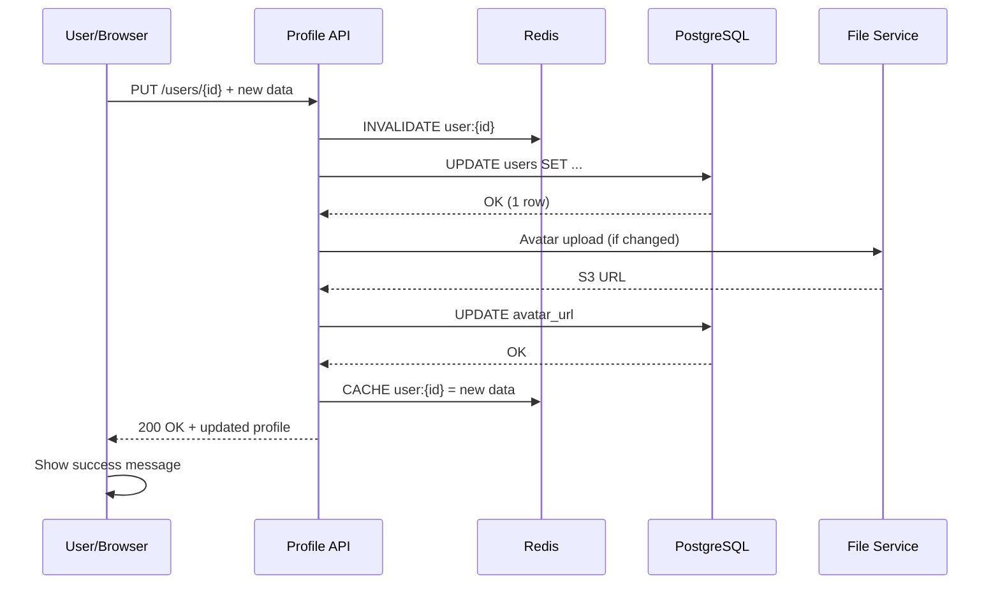
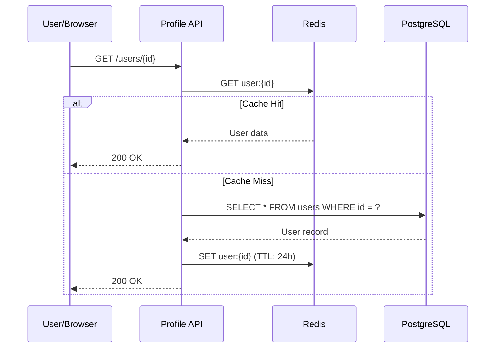

# Architecture Documentation

**Doc ID**: ARCH-[###]  
**Related Story**: AB#[work-item-id]  
**Author**: [Name]  
**Date**: [YYYY-MM-DD]  
**Status**: Draft | **In Review** | Approved | Superseded  

> **SDLC alignment:** Prefer the **system design** template (`design-doc-template.md`) for engineering handoff. Narrative arch docs must still trace to **PRD / Master / Sprint** and [`AUTHORING_STANDARDS.md`](AUTHORING_STANDARDS.md).

---

## §1 Overview

High-level summary of the system architecture:
- What systems are covered by this architecture?
- What is the primary responsibility of each system?
- How do systems interact at a high level?
- Key architectural patterns and frameworks used

Example: "User Profile Service is a microservice providing user account management, profile editing, and preference storage. Exposes REST API with PostgreSQL persistence. Integrates with Auth Service for user verification and File Service for avatar storage."

---

## §2 System Context

Diagram showing system within the broader business/technical environment:

```
┌─────────────────────────────────────────────────┐
│ External Systems                                │
│  ┌──────────────┐  ┌──────────────┐             │
│  │  Auth        │  │  File        │             │
│  │  Service     │  │  Service     │             │
│  └──────┬───────┘  └──────┬───────┘             │
│         │                  │                    │
├─────────┼──────────────────┼────────────────────┤
│  Our System               │                    │
│  ┌─────────────────────────▼──────┐            │
│  │  User Profile Service          │            │
│  │  - Profile Management          │            │
│  │  - Preference Storage          │            │
│  │  - Bio/Avatar Updates          │            │
│  └──────────────┬──────────────────┘            │
│                 │                              │
│  ┌──────────────▼──────────────┐               │
│  │  PostgreSQL DB              │               │
│  │  - users table              │               │
│  │  - preferences table        │               │
│  └─────────────────────────────┘               │
└─────────────────────────────────────────────────┘
```

**External Dependencies**:
- Auth Service: User authentication and token validation
- File Service: Avatar image storage and retrieval
- PostgreSQL: User data persistence
- Redis: Session caching (optional)

**Internal Consumers**:
- Dashboard Service: Reads user profile data
- Notification Service: Accesses user preferences for notification routing
- Analytics Service: Consumes profile update events

---

## §3 Container Architecture

Deployment view showing containerized components and their relationships:

```
┌─────────────────────────────────────────────────┐
│ Kubernetes Cluster (Production)                 │
│                                                 │
│  ┌──────────────────────────────────────────┐   │
│  │ User Profile Service (Container)         │   │
│  │  - Spring Boot 3.2                       │   │
│  │  - Java 17                               │   │
│  │  - 3 replicas (HA)                       │   │
│  │  - Health checks enabled                 │   │
│  │  - Liveness probe: /actuator/health      │   │
│  │  - Readiness probe: /actuator/ready      │   │
│  │  - Resource limits: 1 CPU, 512MB RAM     │   │
│  └───────────────┬──────────────────────────┘   │
│                  │                              │
│  ┌──────────────┴──────────────────────────┐   │
│  │ PostgreSQL Container                    │   │
│  │  - Version 14                           │   │
│  │  - Persistent Volume (AWS EBS)          │   │
│  │  - Backup: daily snapshots              │   │
│  │  - Replication: primary + 1 standby     │   │
│  └─────────────────────────────────────────┘   │
│                                                 │
│  ┌──────────────────────────────────────────┐   │
│  │ Redis Container (Session Cache)          │   │
│  │  - Version 7.0                          │   │
│  │  - Sentinel for HA                      │   │
│  │  - TTL: 24 hours                        │   │
│  └─────────────────────────────────────────┘   │
└─────────────────────────────────────────────────┘
```

---

## §4 Component Architecture

Detailed view of internal components and their interactions:

```
┌─────────────────────────────────────────────────────────┐
│ User Profile Service                                    │
│                                                         │
│ Controllers (REST API)                                  │
│ ┌──────────────────────────────────────────────────┐   │
│ │ UserProfileController                            │   │
│ │  - GET /api/v1/users/{id}                        │   │
│ │  - PUT /api/v1/users/{id}                        │   │
│ │  - POST /api/v1/users/{id}/avatar               │   │
│ │  - GET /api/v1/preferences/{id}                  │   │
│ │  - PUT /api/v1/preferences/{id}                  │   │
│ └──────────────────────────────────────────────────┘   │
│                    │                                    │
│ Services (Business Logic)                              │
│ ┌──────────────────┼─────────────────────────────┐    │
│ │ UserProfileService                             │    │
│ │ ├─ createProfile()                             │    │
│ │ ├─ updateProfile()                             │    │
│ │ ├─ deleteProfile()                             │    │
│ │ └─ validateProfileData()                       │    │
│ │                                                │    │
│ │ PreferenceService                              │    │
│ │ ├─ getPreferences()                            │    │
│ │ ├─ updateNotificationSettings()               │    │
│ │ ├─ updatePrivacySettings()                     │    │
│ │ └─ validatePreferences()                       │    │
│ └──────────────────┼─────────────────────────────┘    │
│                    │                                    │
│ Repositories (Data Access)                             │
│ ┌──────────────────┼─────────────────────────────┐    │
│ │ UserProfileRepository (JPA)                     │    │
│ │ ├─ save(profile)                               │    │
│ │ ├─ findById(id)                                │    │
│ │ ├─ update(profile)                             │    │
│ │ └─ delete(id)                                  │    │
│ │                                                │    │
│ │ PreferenceRepository (JPA)                      │    │
│ │ ├─ save(prefs)                                 │    │
│ │ ├─ findByUserId(id)                            │    │
│ │ └─ delete(userId)                              │    │
│ └──────────────────┼─────────────────────────────┘    │
│                    │                                    │
│ Cache Layer (Redis)                                    │
│ ├─ UserProfileCache                                    │
│ ├─ PreferenceCache                                     │
│ └─ SessionCache                                        │
└─────────────────────────────────────────────────────────┘
```

---

## §5 Architecture Decisions

Key technical decisions and trade-offs:

| Decision | Choice | Rationale | Alternative Rejected |
|----------|--------|-----------|----------------------|
| API Protocol | REST with JSON | Standard, team familiar, simple versioning | GraphQL (overkill), gRPC (complexity) |
| Database | PostgreSQL | ACID guarantees, JSON support, team expertise | MongoDB (weak schema), MySQL (limited JSON) |
| Caching | Redis | Sub-100ms latency targets, data freshness | In-memory cache (can't scale), Memcached (limited features) |
| Framework | Spring Boot | Enterprise standard, ecosystem, security | Quarkus (learning curve), Micronaut (unfamiliar) |
| Authentication | OAuth 2.0 + JWT | Industry standard, delegated auth | Session cookies (monolithic), Basic auth (insecure) |
| Deployment | Docker + Kubernetes | Scalability, HA, cloud-native | VMs (operational overhead), Fargate (AWS lock-in) |
| File Storage | S3 + CloudFront | Scalable, CDN support, durable | Local disk (limits scaling), GCS (multi-cloud complexity) |

---

## §6 Data Flow

Key data flows and interaction sequences:

### User Profile Update Flow



### Profile Retrieval with Cache



---

## §7 Non-Functional Requirements

System quality attributes and targets:

### Performance
- **Response Time (p95)**: User profile GET <100ms, PUT <500ms
- **Throughput**: Handle 10,000 requests/second (RPS)
- **Cache Hit Rate**: >80% for profile reads

### Availability
- **Uptime SLA**: 99.95% (4.38 hours downtime/year)
- **Failover Time**: Automated failover <30 seconds
- **Redundancy**: 3 API replicas, 1 database primary + 1 standby

### Scalability
- **Horizontal Scaling**: Support 10x traffic increase via Kubernetes HPA
- **Database Scaling**: Vertical scaling to 32 CPU, 128GB RAM
- **Caching Strategy**: Redis cluster with sharding

### Security
- **Authentication**: OAuth 2.0 with JWT tokens (15-min TTL)
- **Authorization**: Role-based access control (RBAC)
- **Encryption**: TLS 1.3 in transit, AES-256 at rest (field-level for PII)
- **Audit Logging**: All profile changes logged to audit table

### Observability
- **Logging**: Structured JSON logs to ELK stack
- **Metrics**: Prometheus metrics (request duration, error rate, cache hit rate)
- **Tracing**: Distributed tracing (Jaeger) with 10% sampling
- **Alerting**: PagerDuty alerts for latency >500ms, error rate >1%

---

## §8 Deployment Architecture

How the system is deployed and managed:

```
┌──────────────────────────────┐
│ Source Control (GitHub)      │
│ - main branch (production)   │
│ - dev branch (staging)       │
└──────────────┬───────────────┘
               │
               ▼
       ┌───────────────────┐
       │ CI Pipeline       │
       │ (GitHub Actions)  │
       │ ✓ Unit tests      │
       │ ✓ Integration     │
       │ ✓ Security scan   │
       │ ✓ Build Docker    │
       └─────────┬─────────┘
               │
               ▼
       ┌───────────────────┐
       │ Artifact Registry │
       │ - Docker images   │
       │ - Version tagged  │
       └─────────┬─────────┘
               │
               ▼
       ┌───────────────────┐
       │ Deployment        │
       │ ├─ Staging env    │
       │ ├─ UAT env        │
       │ └─ Production env │
       └───────────────────┘
```

---

## §9 Monitoring & Alerting

System health and operational visibility:

**Key Metrics**:
- API latency (p50, p95, p99)
- Error rate (4xx, 5xx)
- Cache hit rate
- Database connection pool utilization
- JVM heap memory usage

**Dashboards**:
- Real-time API health (Grafana)
- Database performance (CloudWatch)
- Error tracking (Sentry)
- User impact analysis (custom dashboard)

**Alerting Thresholds**:
- Latency p95 > 500ms (warning) / > 1000ms (critical)
- Error rate > 1% (warning) / > 5% (critical)
- Database connection pool > 80% (warning)
- Disk usage > 85% (warning)

---

## §10 Operational Procedures

Disaster recovery and maintenance practices:

### Backup & Recovery
- **Database Backups**: Daily snapshots to S3, 30-day retention
- **RTO (Recovery Time Objective)**: 15 minutes
- **RPO (Recovery Point Objective)**: 1 hour
- **Test Frequency**: Monthly DR drills

### Disaster Scenarios
- **Database Failure**: Automatic failover to standby (replication lag <1 second)
- **API Pod Failure**: Kubernetes auto-restarts pod (30-second grace period)
- **Cache Failure**: Graceful degradation (reads from DB, slight latency increase)
- **Regional Outage**: Failover to secondary region (manual, <1 hour RTO)

### Maintenance Windows
- **Patching**: Monthly, 2:00-3:00 AM UTC (0% user traffic)
- **Database Upgrades**: Quarterly (rolling, blue-green deployment)
- **Dependency Updates**: Bi-weekly, automated security patches

---

## References

- **Design Doc**: `design-doc.md`
- **ADR Records**: `adr-001.md`, `adr-002.md`, `adr-003.md`
- **API Spec**: `api-documentation.md`
- **Deployment Guide**: `deployment-runbook.md`
- **Operations Manual**: `operations-manual.md`

---

**Status**: Ready for review ✓  
**Last Updated**: [date]
