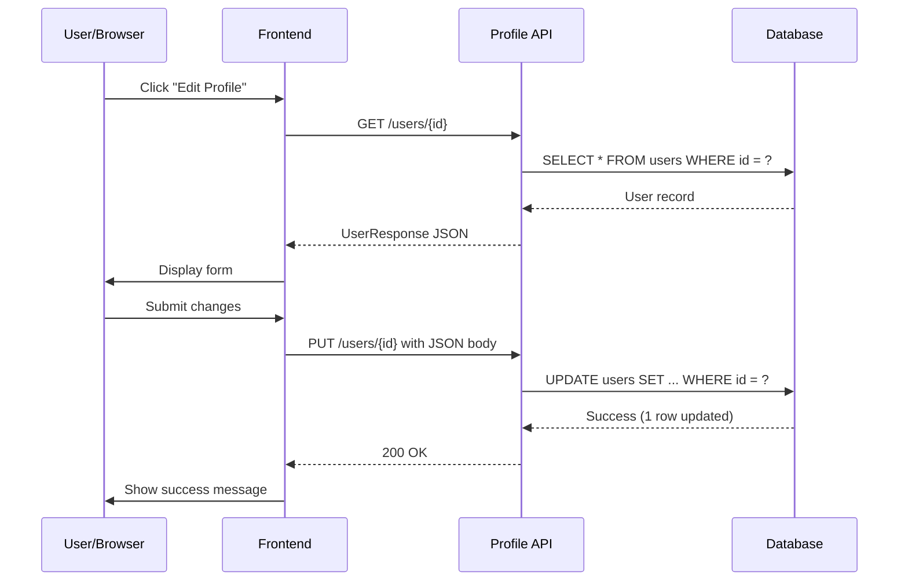

# System Design Document

**Design ID**: DD-[###]  
**Related Story**: AB#[work-item-id]  
**Author**: [Name]  
**Date**: [YYYY-MM-DD]  
**Status**: Draft | **In Review** | Approved  

> **Authoring:** Ground decisions in **existing** code and contracts (§0). Align **Tech Story** and implementation to this doc—see [AUTHORING_STANDARDS.md](AUTHORING_STANDARDS.md).

---

## §0 Repository baseline & change surface

**Purpose:** Anchor this design in what **already exists** in the repo and in the **module knowledge base** so new work does not silently break callers, contracts, or tests.

**Token efficiency:** Keep this section **short**—**cite** paths and stable API/event/data identifiers; do **not** paste large contract or source excerpts here. When using AI assistance, prefer `sdlc module show` or `sdlc module load <api|data|events|logic>` for scoped context instead of bulk-loading every file under `.sdlc/module/`.

### Module knowledge base (application repo)

If you are designing against a codebase, ensure the unified module system is present or refreshed:

- Run from the **application repository root**: `sdlc module init .` (first time) or `sdlc module update .` (after code changes).
- Generated paths (typical): `.sdlc/module/contracts/` (`api.yaml`, `data.yaml`, `events.yaml`, `dependencies.yaml`) and `.sdlc/module/knowledge/` (`manifest.md`, `known-issues.md`, `impact-rules.md`, `tech-decisions.md`).
- For a quick read-only view: `sdlc module show` (or `sdlc module load` for token-efficient slices).

If `.sdlc/module/` does not exist yet, state that here and plan when `module init` will run.

### Existing code, services, and repo paths

List **concrete paths** (files, packages, modules) this design **extends, calls, or replaces**—not only net-new components:

| Area | Repo path(s) or package | Role (read / extend / replace) |
|------|-------------------------|--------------------------------|
| Example | `src/services/profile/` | Extend |
| | | |

### Contracts & APIs relied on

Reference stable identifiers already in repo or in module contracts (e.g. REST paths, event names, DB tables, schema versions):

- 

### Backward compatibility & regression risk

What **must keep working** after this change (existing callers, mobile/web clients, jobs, integrations)? What **tests or suites** currently guard that behavior?

- **Invariants:** 
- **Regression concern:** 

### Prior decisions (ADRs / tech decisions)

Link or cite entries from `docs/adr/`, `.sdlc/module/knowledge/tech-decisions.md`, or team ADRs that constrain this design:

- 

---

## §1 What We Build
High-level summary of the feature/system:
- What is the end-user deliverable?
- What problem does it solve?
- 3-5 sentences maximum

Example: "User profile page allowing users to view and edit their bio, avatar, and notification preferences. Fetches data from Profile API and persists changes via REST calls."

---

## §2 How It Fits
Where does this sit in the overall system?
- Which services does it integrate with?
- What systems does it depend on?
- What depends on this system?

**Cross-check:** Must align with **§0** (baseline paths and contracts).

Example:
```
Frontend (React)
  └─ User Profile Page
       ├─ Calls Profile Service API
       ├─ Calls File Upload Service (avatar)
       └─ Calls Notification Preferences Service
```

---

## §3 Data Flow (Mermaid Diagram)
Visual representation of data movement:



---

## §4 Tech Decisions
Key architectural choices:

| Decision | Choice | Rationale | Alternative Rejected |
|----------|--------|-----------|----------------------|
| Database | PostgreSQL (existing) | ACID guarantees, team expertise | MongoDB (complexity) |
| API Style | REST with JSON | Team familiar, simple versioning | GraphQL (overkill) |
| Caching | Redis (user:${id}) | Sub-100ms response targets | In-memory cache (can't cluster) |
| File Storage | S3 for avatars | Scalable, CDN-friendly | Local disk (limits scaling) |

---

## §5 Module Impact

**Cross-reference §0** for baseline paths; here spell out **delta** (what changes in each place).

### Backend Profile Service
- **File**: `UserProfileController.java`
- **New Classes**: UserProfileRequest, UserProfileResponse, ProfileValidator
- **API Endpoint**: PUT /api/v1/users/{id} with request body
- **Database**: New `user_profile` table with fields (bio, avatar_url, updated_at)

### Frontend Profile Page
- **File**: `src/modules/profile/screens/EditProfile.tsx`
- **New Components**: EditProfileForm, AvatarUploader, PreferencesSelector
- **State**: useState for form values, loading state, error handling
- **API Calls**: Fetch profile on mount, submit on form submit

### File Upload Service
- **Endpoint**: POST /api/v1/files/upload (multipart/form-data)
- **Validation**: Image only (png/jpg), max 5MB
- **Response**: { fileUrl: "https://s3.../avatar_123.jpg" }

---

## §6 What We Don't Change
Explicitly list what stays the same (prevents scope creep). **Must be consistent with §0** (baseline and invariants).

- Authentication service (separate story)
- User account creation (separate story)
- Dashboard layout (out of scope)
- User permissions/roles (out of scope)

---

## §7 Risks & Mitigations

| Risk | Impact | Probability | Mitigation |
|------|--------|-------------|------------|
| Large avatar uploads slow page | Page load >5s | Medium | Compress images client-side, set 5MB max |
| S3 credentials exposed in frontend | Security breach | Low | Use pre-signed URLs (backend-generated) |
| Concurrent updates create conflicts | Data loss | Low | Add `version` field, implement optimistic locking |
| API changes break mobile app | Mobile app crashes | Medium | Maintain 2 API versions concurrently for 6 months |

---

## Assumptions
- User avatars <5MB each
- Profile updates <once per minute per user
- <10K concurrent active users during peak

## Out of Scope
- User profile deletion
- User profile history/audit trail
- Bulk user data export

---

## Timeline
- **Implementation**: 3 days
- **Testing**: 2 days
- **Code Review**: 1 day
- **Deployment**: Release in sprint +2

---

**Reviewed By**: [Name], [Name]  
**Approved**: ☐ Tech Lead ☐ Product Owner  

---
**Last Updated**: [date]
