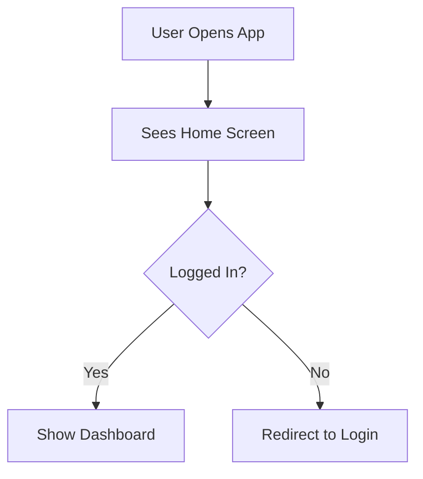

# Product Requirements Document (PRD)

**Document ID**: AB#[work-item-id]  
**Version**: 1.0  
**Status**: Draft | **In Review** | Approved  
**Last Updated**: [date]  
**Product Owner**: [name]  

---

## §1 Overview
High-level summary of what is being built. 1-2 paragraphs. Answer: What is this product/feature?

---

## §2 Problem Statement
The problem we're solving. Include:
- Customer pain point(s)
- Business impact (lost revenue, churn, etc.)
- Current state (without solution)

---

## §3 Goals & Success Metrics
**Primary Goal**: One clear objective

**Success Metrics**:
- Metric 1: [target value] (measurement method)
- Metric 2: [target value] (measurement method)
- Metric 3: [target value] (measurement method)

**Anti-Goals**: What we explicitly won't do

---

## §4 User Personas
Define 2-3 primary personas:
- **Name**: User type
- **Role**: Job title
- **Goals**: What they want to achieve
- **Pain Points**: Current frustrations
- **Tech Fluency**: Basic | Intermediate | Advanced

---

## §5 User Flows
Include Mermaid diagrams for:
- Happy path (normal use)
- Error/alternative paths
- Edge cases (empty state, network error, etc.)

---

## §6 Functional Requirements
Detailed requirements grouped by feature:

### Feature A: Authentication
- FR-1: User can sign up with email
- FR-2: User can reset password via email link
- FR-3: System validates email format

### Feature B: User Profile
- FR-4: User can update profile picture
- FR-5: User can modify bio (max 250 chars)

### User-visible copy, notifications & errors *(required when UX surfaces copy)*

**Purpose:** This is the **source of truth** for strings that **Master / Sprint stories** will lift verbatim into Azure DevOps. Do **not** reference “Notification Nx” in stories without defining the full text **here** first.

Use tables—not prose only—for scanability.

#### Notifications / toasts / in-app messages

| ID | Text (all locales required by product) | Surface (toast, modal, inline, …) | Trigger |
|----|----------------------------------------|-------------------------------------|---------|
| N1 | | | |

#### Errors and edge-case copy

| ID | Message | When shown |
|----|---------|------------|

#### Limits, labels, and enums *(if not covered in FR bullets)*

| Item | Value / allowed set | Notes |
|------|---------------------|-------|

---

## §7 Non-Functional Requirements
- **Performance**: API response time <500ms (p95)
- **Availability**: 99.9% uptime SLA
- **Scalability**: Support 1M concurrent users
- **Security**: SOC2 Type II compliance
- **Accessibility**: WCAG 2.1 AA standard
- **Localization**: Support 5 languages (TBD list)

---

## §8 Analytics & Tracking
Events to track:
- `user_signup` — {email, signup_source}
- `user_login` — {email, device_type}
- `feature_used` — {feature_name, duration_seconds}

Funnel: Signup → Verify Email → Complete Profile → First Action

---

## §9 Design References
Link to Figma designs:
- [Figma Link: Screens](https://figma.com/...)
- Screenshots of key flows
- Component library reference

---

## §10 Dependencies
**External Dependencies**:
- Email service (SendGrid or similar)
- Analytics service (Mixpanel or similar)

**Team Dependencies**:
- Backend API contract (AB#[ID]) — [owner team]
- Database migration (AB#[ID]) — [owner team]

---

## §11 Constraints & Assumptions
**Constraints**:
- Must work on iOS 14+
- Cannot use 3rd-party auth providers initially
- Limited to 2 engineers

**Assumptions**:
- Email delivery success rate >99%
- User base grows 10% monthly
- Mobile-first usage (80%)

---

## §12 Open Questions
- [ ] Should we support OAuth2 in phase 2?
- [ ] What email service should we use?
- [ ] How do we handle account deletion GDPR requirement?

---

## §13 Out of Scope
- Two-factor authentication (future story)
- Social login integrations (future story)
- Offline mode (future consideration)

---

## §14 Timeline
- **Discovery**: [date range]
- **Design**: [date range]
- **Development**: [date range]
- **QA/Testing**: [date range]
- **Launch**: [target date]

---

**Stakeholders**: Product, Engineering Lead, Design Lead  
**Approvals**: Pending ☐ Product ☐ Engineering ☐ Design  

---
**Last Updated**: [date]
